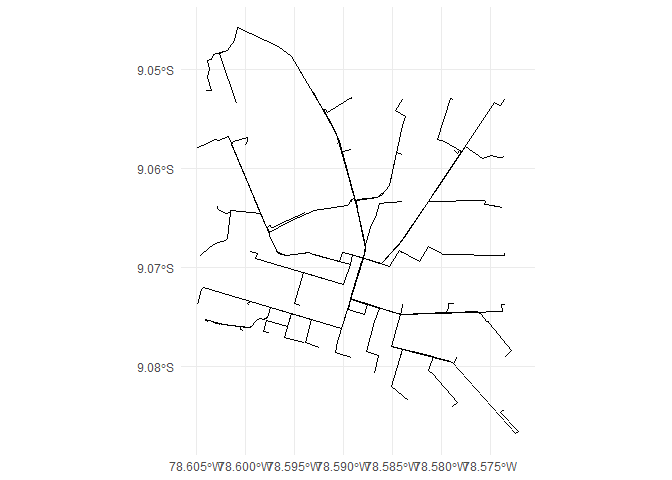
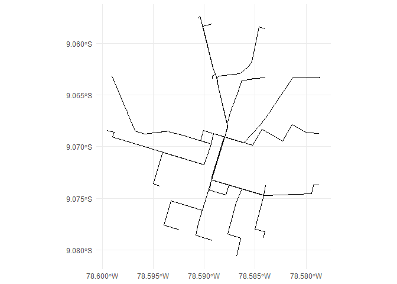
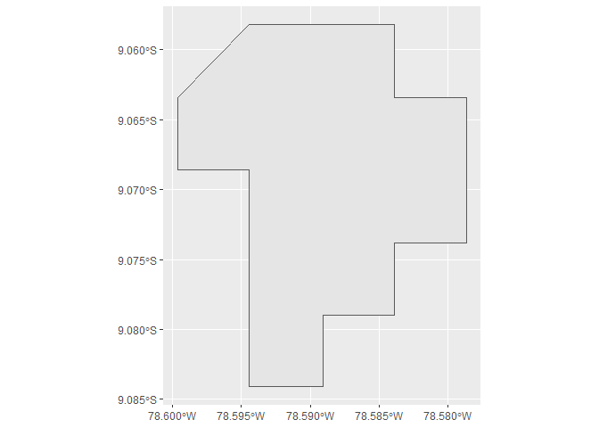
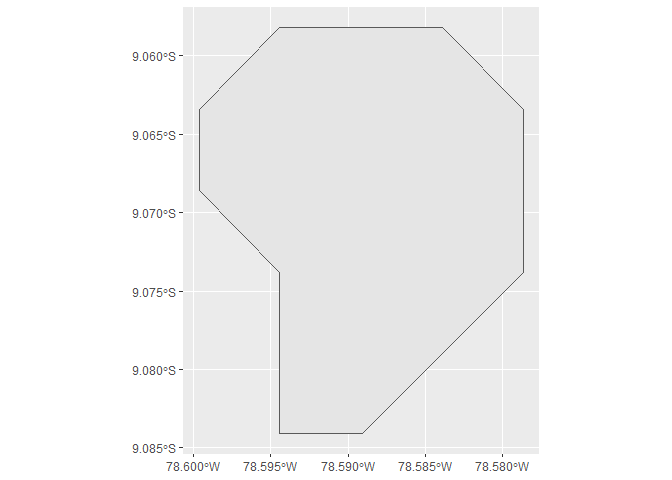
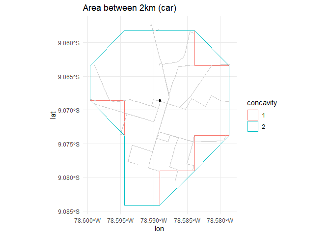

# OSRM areas

# Installation

``` r
# install.packages('remotes')
# remotes::install_github('d2cml-ai/osrmareas')
```

# Usage

``` r
library(osrmareas)
library(ggplot2)
library(dplyr)
```

``` r
lat <- -9.0686007
lon <- -78.5891182

routes <- get_routes_inside(lat, lon, radius_km = 2, grid_size = 0.300)
```

     ■■■■                              10% |  ETA: 15s

     ■■■■■■■■■■■■■                     39% |  ETA:  7s

     ■■■■■■■■■■■■■■■■■■■■■             67% |  ETA:  4s

     ■■■■■■■■■■■■■■■■■■■■■■■■■■■■■■    96% |  ETA:  0s

``` r
routes
```

    Simple feature collection with 49 features and 6 fields
    Geometry type: LINESTRING
    Dimension:     XY
    Bounding box:  xmin: -78.60491 ymin: -9.08677 xmax: -78.57216 ymax: -9.04581
    Geodetic CRS:  WGS 84
    First 10 features:
                 duration distance         x         y
    src_dst...1  4.546667   2.6409 -78.60481 -9.084138
    src_dst...2  4.078333   2.1288 -78.59959 -9.084138
    src_dst...3  3.378333   1.7461 -78.59437 -9.084138
    src_dst...4  3.096667   1.8123 -78.58915 -9.084138
    src_dst...5  4.255000   2.3772 -78.58393 -9.084138
    src_dst...6  4.213333   2.7717 -78.57871 -9.084138
    src_dst...7  5.561667   3.7278 -78.57349 -9.084138
    src_dst...8  4.618333   2.6891 -78.60481 -9.078958
    src_dst...9  4.155000   2.3272 -78.59959 -9.078958
    src_dst...10 3.891667   2.0509 -78.59437 -9.078958
                                       geometry  x_origin  y_origin
    src_dst...1  LINESTRING (-78.58915 -9.06... -78.58912 -9.068601
    src_dst...2  LINESTRING (-78.58915 -9.06... -78.58912 -9.068601
    src_dst...3  LINESTRING (-78.58915 -9.06... -78.58912 -9.068601
    src_dst...4  LINESTRING (-78.58915 -9.06... -78.58912 -9.068601
    src_dst...5  LINESTRING (-78.58915 -9.06... -78.58912 -9.068601
    src_dst...6  LINESTRING (-78.58915 -9.06... -78.58912 -9.068601
    src_dst...7  LINESTRING (-78.58915 -9.06... -78.58912 -9.068601
    src_dst...8  LINESTRING (-78.58915 -9.06... -78.58912 -9.068601
    src_dst...9  LINESTRING (-78.58915 -9.06... -78.58912 -9.068601
    src_dst...10 LINESTRING (-78.58915 -9.06... -78.58912 -9.068601

``` r
p1 <- 
  ggplot(routes) + 
  geom_sf() + 
  coord_sf() +
  theme_minimal()
p1
```



Filter points inside 10km

``` r
km_max <- 2
routes_km <- routes |> 
  dplyr::filter(distance < km_max) 

p2 <- 
  routes_km |> 
  ggplot() +
  geom_sf() +
  theme_minimal()
p2
```



Generate a polygon shapefile

``` r
area1 <- 
  get_area(routes_km, km_max, concavity = 1) 
area2 <- 
  get_area(routes_km, km_max, concavity = 2)

area1 |> 
  ggplot() +
  geom_sf()
```



``` r
area2 |> 
  ggplot() +
  geom_sf()
```



# Routes inside the area

``` r
bind_rows(area1, area2) |> 
  mutate(concavity = row_number() |> factor()) |> 
  ggplot() +
  geom_sf(aes(color = concavity), fill = NA) +
  geom_sf(data = routes_km, color = "grey80") +
  geom_point(aes(lon, lat)) +
  labs(title = "Area between 2km (car)") +
  theme_minimal() 
```


